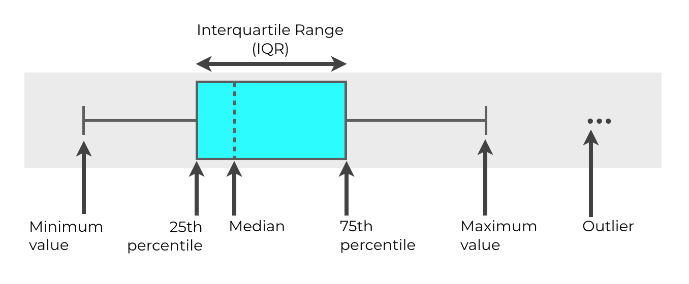

# Medidas de tendencia central

## Media aritmética

$$
\bar x = \frac{1}{n} \sum_{i+1}^n x_i
$$
Es la medida más usada, pero es sensible a valores atípicos

## Mediana 

Es el valor que queda exactamente en el centro cuando los datos se ordenan de menor a mayor.

- Si $n$ es par, es el promedio de los dos datos centrales.
- La mediana es robusta a valores atípicos

## Moda

Es el valor (o categoría) que ocurre con mayor frecuencia.

- Es la única medida para valores categóricos

## Media geométrica
$$
\bar x_g = \sqrt{n}{x_1 x_2 \cdots x_n}
$$

Se usa cuando los datos son tasas de crecimiento o cambios porcentuales.

- promedia bien cantidades que se multiplican en el tiempo

## Cuartiles

Dividen en cuatro partes iguales a los datos ordenados:
- $Q_1$ contiene el 25% de datos inferior
- $Q_2$ contiene el 50% de datos inferior
- $Q_3$ contiene el 75% de datos inferior

# Medidas de variación

## Rango

$$
\text{rango} = x_{\max} - x_{\min}
$$

Es muy sensible a valores atípicos

## Rango intercuartil (RIC)

$$
\text{RIC} = Q_3 - Q_1
$$

Mide la dispersión del 50 % central de los datos
- Es robusto a valores atípicos

## Varianza y desviación estándar

La **varianza** mide la dispersión promedio respecto a la media, al cuadrado
$$
s^2 = \frac{1}{n - 1} \sum_{i=1}^{n} (x_i - \bar{x})^2
$$

La **desviación estándar** usa las unidades de los datos:
$$
s = \sqrt{s^2}
$$

## Coeficiente de variación
$$
\text {CV} = \frac{s}{\bar x }100\%
$$

Compara la variabilidad de dos variables que tienen unidades o escalas distintas. Dice cuál variable varía más.

# Forma de una distribución

La forma describe la simetría, o falta de simetría, de una distribución.

- Simétrica: media $\approx$ mediana 
- Asimétrica a la derecha: media $>$ mediana
- Asimétrica a la izquierda: media $<$ mediana

# Análisis exploratorio de datos (EDA)

Los cinco datos principales son:
$$
x_{\min}, \quad Q_1, \quad \text{mediana}, \quad Q_3, \quad x_{\max}
$$

## Diagrama de caja y bigotes (*boxplot*)

Los bigotes van de $Q_1 - 1.5 \text{RIC}$ hasta $Q_3 + 1.5 \text{RIC}$.

Cualquier observación más allá de esos límites se marca como valor atípico (*outlier*).

Se dibuja una caja para cada variable.

# Coeficiente de correlación

Cuando tenemos dos variables numéricas medidas sobre las mismas observaciones el **diagrama de dispersión** ubica cada observación como un punto $(x_i, y_i)$.

El **coeficiente de correlación de Pearson** mide dicha dispesión:
$$
r = \frac{\sum_{i=1}^{n} (x_i - \bar{x})(y_i - \bar{y})}{\sqrt{\sum_{i=1}^{n} (x_i - \bar{x})^2} \sqrt{\sum_{i=1}^{n} (y_i - \bar{y})^2}} = \frac{\text{Cov}(X, Y)}{\sigma_X \sigma_Y}
$$
$r$ varía entre $-1$ y $1$:

- $r \approx 1$: relación lineal positiva fuerte.
- $r \approx -1$: relación lineal negativa fuerte.
- $r \approx 0$: poca o ninguna relación lineal
